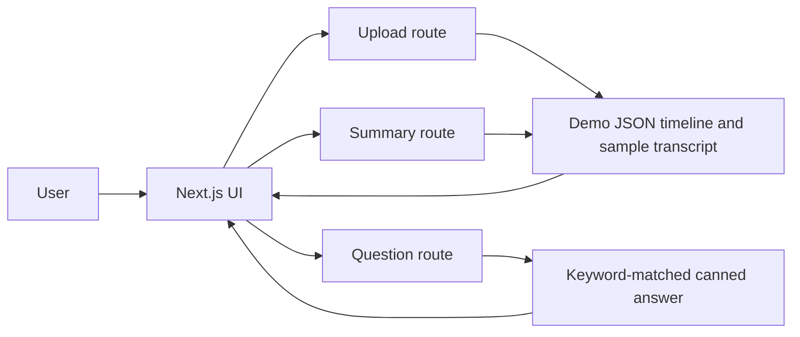

# Multi-Video Study Assistant

<p align="center"><strong>A Next.js interface prototype for uploading a video, viewing a timestamped study timeline, and asking questions about its contents.</strong></p>

<p align="center">Next.js 14 · React · TypeScript · App Router</p>

## Project overview

The `frontend/` application provides a video player, uploader, summary card, timeline, and question-and-answer panel. API routes accept uploads and return structured JSON for the UI.

## Current behavior

The API responses are **scripted demo data**. The upload route does not decode the submitted video or run speech recognition, visual analysis, embeddings, or retrieval. The Q&A endpoint selects a canned answer based on question keywords. Treat the timeline, transcript, keyframes, and confidence values as illustrative UI content, not analysis of the uploaded file.

## Architecture



## Run locally

```bash
cd frontend
npm install
npm run dev
```

Open `http://localhost:3000`.

## Deployment

The app includes `frontend/vercel.json` for a Vercel deployment from the `frontend` directory. The current endpoints are self-contained demo routes and do not require model credentials. Deploying this prototype does not add real video processing or persistent uploads.

## Project structure

- `frontend/app/` — pages and upload, summary, and Q&A routes
- `frontend/components/` — uploader, player, summary, timeline, and chat UI
- `frontend/package.json` — scripts and dependencies

## Next implementation step

Replace the demo route responses with a real media-processing pipeline, add upload limits and storage policy, and connect transcript/visual indexing to retrieval before describing the results as AI-generated.
